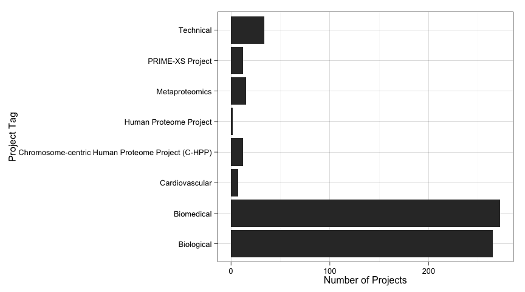

# PRIDE Archive Project Tagger
Jose A. Dianes  
6 April 2015  
# Introduction and Goals  

The [PRIDE Archive](http://www.ebi.ac.uk/pride/archive) uses a system of tags 
to classify datasets. So far these tags are manually assigned by curators. So 
far the PRIDE teach considers the following tags:  

- Biological  
- Biomedical  
- Cardiovascular  
- Chromosome-centric Human Proteome Project (C-HPP)  
- Human Proteome Project  
- Metaproteomics  
- PRIME-XS Project  
- Technical  

In the present analysis, by trying to build a model that predict tags, we want
to find out what are behind those tags. Is it information such as a project
species or tissue relevant to identify a project as biomedical? Is it that
information actually hidden in the dataset textual description?  

# Getting and cleaning the data  

Let's start by getting the latest `prideR` version form `GitHub`, together with 
some other packages we will use to build our model.  


```r
library(devtools)
install_github("PRIDE-R/prideR")
library(prideR)
require(ggplot2)
theme_set(theme_linedraw())
require(tm)
library(caTools)
library(randomForest)
library(pander)
```

Now we get all the projects available in the archive.  


```r
archive.df <- as.data.frame(search.list.ProjectSummary("",0,20000))
```

Kepp only those with a project tag assigned.  


```r
archive.df <- subset(archive.df, project.tags!="Not available")
```

# The tags distribution  

Now we have 619 tagged projects in the dataset. Let's have a 
quick look at how these tags are distributed.  


```r
ggplot(data=archive.df, aes(x=as.factor(archive.df$project.tags))) +
    geom_bar() +
    coord_flip( ) +
    ylab("Number of Projects") +
    xlab("Project Tag")
```

 

As we see, our data project tag distribution is very skewed. This will make 
difficult to build good models, specially now that we have very few projects.  

# Using meta-data  

Let's start by trying to predict projects tags based on meta-data only. That is,
by using information such as the *species*, *tissues*, and so on.  

## Preparing meta-data  

Right now we have all the metadata associated to PRIDE datasets in text format.
In order to use it to build a model we better convert it to categorica data.
However, most of them have too many differnet values for R machine libraries to
make use of them as predictors. For that reason we need to aggregate those low
frequency values into a unique `Other` factor level.  


```r
species.counts <- table(archive.df$species)
low.freq.species <- as.factor(names(which(species.counts<3)))
archive.df[archive.df$species %in% low.freq.species,]$species <- "Other"
archive.df$species <- as.factor(archive.df$species)

tissues.counts <- table(archive.df$tissues)
low.freq.tissues <- as.factor(names(which(tissues.counts<3)))
archive.df[archive.df$tissues %in% low.freq.tissues,]$tissues <- "Other"
archive.df$tissues <- as.factor(archive.df$tissues)

ptm.counts <- table(archive.df$ptm.names)
low.freq.ptm <- as.factor(names(which(ptm.counts<3)))
archive.df[archive.df$ptm.names %in% low.freq.ptm,]$ptm.names <- "Other"
archive.df$ptm.names <- as.factor(archive.df$ptm.names)

instrument.counts <- table(archive.df$instrument.names)
low.freq.instrument <- as.factor(names(which(instrument.counts<3)))
archive.df[archive.df$instrument.names %in% low.freq.instrument,]$instrument.names <- "Other"
archive.df$instrument.names <- as.factor(archive.df$instrument.names)

archive.df$project.tags <- as.factor(archive.df$project.tags)
archive.df$submissionType <- as.factor(archive.df$submissionType)
```

## Exploring metadata  

Let's explore a bit how each piece of metadata is distributed accross each 
project tag. This might give us some insight into useful predictos if we
find any species, tissue, etc., more present in a particular tag than others.  

For that we will build a linear model and check the statistical importance of each
predictor.  


```r
meta_log_model <- glm(
    project.tags ~ species + tissues + ptm.names + instrument.names + num.assays + submissionType, 
    data=archive.df, 
    family=binomial)
```

```
## Warning: glm.fit: fitted probabilities numerically 0 or 1 occurred
```

```r
meta_log_model_summary <- summary(meta_log_model)
relevant_meta <- names(which(meta_log_model_summary$coefficients[,4]<0.05))
```

And we see that the following predictors are statistically significan when 
predicting tags **assuming a linear relationship**:  


|                  Predictor                  |
|:-------------------------------------------:|
|         speciesHomo sapiens (Human)         |
|         speciesMus musculus (Mouse)         |
|       speciesRattus norvegicus (Rat)        |
| speciesSus scrofa domesticus (domestic pig) |
|             submissionTypePRIDE             |

We cannot conclude much due to two factors. First, our relationship is surely
not linear. And second, our dataset is too small to model better relationships.
But at least it seems to be some relationship between *species*, and 
*submission type*, and the project tag.  

## A meta-data only model  

Let's try now a *Random Forest* model using just metadata predictors. We know 
our dependent variable is very skewed, so don't expect too much accuracy. We 
decide for this type of model due to its success with non-linear problems.  

First of all, prepare a train/test split so we can check accuracy. We also 
have the problem of having too few data in general. Hopefully our models will
get better while PRIDE datasets get more numerous.  


```r
set.seed(123)
spl <- sample.split(archive.df, .85)

evalTrain <- archive.df[spl==T,]
evalTest <- archive.df[spl==F,]
```

And now train the model.  


```r
set.seed(123)
rfModelMeta <- randomForest(
    project.tags ~ species + tissues + ptm.names + instrument.names + submissionType, 
    data = evalTrain)
# Calculate accuracy on the test set
rfPredMeta <- predict(rfModelMeta, newdata=evalTest)
t <- table(evalTest$project.tags, rfPredMeta)
meta_accuracy <- (t[1,1] + t[2,2] + t[3,3] + t[4,4] + t[5,5] + t[6,6] + t[7,7] + t[8,8]) / nrow(evalTest)
```

We have a prediction accuracy of **0.7232143** on the test data. We can 
also see how the model struggles to predict on classes with very few cases and
does better with large classes.   


|                         &nbsp;                          |  Biological  |  Biomedical  |  Cardiovascular  |  Chromosome-centric Human Proteome Project (C-HPP)  |  Human Proteome Project  |  Metaproteomics  |  PRIME-XS Project  |  Technical  |
|:-------------------------------------------------------:|:------------:|:------------:|:----------------:|:---------------------------------------------------:|:------------------------:|:----------------:|:------------------:|:-----------:|
|                     **Biological**                      |      38      |      8       |        0         |                          0                          |            0             |        1         |         0          |      1      |
|                     **Biomedical**                      |      8       |      41      |        0         |                          0                          |            0             |        0         |         0          |      0      |
|                   **Cardiovascular**                    |      0       |      1       |        0         |                          0                          |            0             |        0         |         0          |      0      |
|  **Chromosome-centric Human Proteome Project (C-HPP)**  |      0       |      0       |        0         |                          1                          |            0             |        0         |         0          |      0      |
|               **Human Proteome Project**                |      0       |      0       |        0         |                          0                          |            0             |        0         |         0          |      0      |
|                   **Metaproteomics**                    |      2       |      3       |        0         |                          0                          |            0             |        0         |         0          |      0      |
|                  **PRIME-XS Project**                   |      0       |      3       |        0         |                          0                          |            0             |        0         |         0          |      0      |
|                      **Technical**                      |      2       |      2       |        0         |                          0                          |            0             |        0         |         0          |      1      |

# Using text fields  

Surely PRIDE curators use textual description about datasets in order to assign
a tag to them. Let's try to incorporate that information into our models in order
to predict a dataset tag.  

## Preparing the corpus  

We have two textual fields, `project.title` and  `project.description`. Let's 
prepare a corpus with both of them. In both cases we will reduce them to 
lowercase, remove punctuation and stopwords, and apply stemming.   


```r
library(tm)
evalTrain$AllText <- do.call(paste, evalTrain[,c("project.title","project.description")])
evalTest$AllText <- do.call(paste, evalTest[,c("project.title","project.description")])

corpusAll <- Corpus(VectorSource(c(evalTrain$AllText, evalTest$AllText)))
corpusAll <- tm_map(corpusAll, tolower)
corpusAll <- tm_map(corpusAll, PlainTextDocument)
corpusAll <- tm_map(corpusAll, removePunctuation)
corpusAll <- tm_map(corpusAll, removeWords, stopwords("english"))
corpusAll <- tm_map(corpusAll, stripWhitespace)
corpusAll <- tm_map(corpusAll, stemDocument)
```

We will also keep just those terms appearing in at least 3 percent of the projects.  


```r
# Generate term matrix
dtmAll <- DocumentTermMatrix(corpusAll)
sparseAll <- removeSparseTerms(dtmAll, 0.99)
allWords <- data.frame(as.matrix(sparseAll))

colnames(allWords) <- make.names(colnames(allWords))
```

## Selecting significative terms  

We have ended up with **214 possible predictors**. But we can do 
better than this. We are going to train a *linear model* using them and our
dependent variable as outcome. Then we will get those variables that are
statistically significative and incorporate them to the main dataset that
we will use with our final model.  


```r
# Find most significative terms
allWordsTrain2 <- head(allWords, nrow(evalTrain))
allWordsTrain2$Popular <- evalTrain$project.tag
logModelAllWords <- glm(Popular~., data=allWordsTrain2, family=binomial)
all_three_star_terms <- names(which(summary(logModelAllWords)$coefficients[,4]<0.001))
all_two_star_terms <- names(which(summary(logModelAllWords)$coefficients[,4]<0.01))
all_one_star_terms <- names(which(summary(logModelAllWords)$coefficients[,4]<0.05))

# Leave just those terms that are different between popular and unpopular articles
allWords <- subset(allWords, 
                   select=names(allWords) %in% all_one_star_terms)

# Split again
allWordsTrain <- head(allWords, nrow(evalTrain))
allWordsTest <- tail(allWords, nrow(evalTest))

# Add to dataframes
evalTrain <- cbind(evalTrain, allWordsTrain)
evalTest <- cbind(evalTest, allWordsTest)

# Remove all text variable since we don't need it
evalTrain$AllText <- NULL
evalTest$AllText <- NULL
```

We ended up with just **35 predictors** that will be 
incorporated into our model. These are the terms together with their mean 
frequencies by project tag (remember they are **stemmed**):  


```r
allWords$project.tag <- archive.df$project.tag
panderOptions('round', 2)
panderOptions('keep.trailing.zeros', TRUE)
pander(t(aggregate(.~project.tag, data=allWords, mean)), style = "rmarkdown", split.table = Inf)
```


|                    |             |             |                |                                                   |                        |                |                  |             |
|:------------------:|:-----------:|:-----------:|:--------------:|:-------------------------------------------------:|:----------------------:|:--------------:|:----------------:|:-----------:|
|  **project.tag**   | Biological  | Biomedical  | Cardiovascular | Chromosome-centric Human Proteome Project (C-HPP) | Human Proteome Project | Metaproteomics | PRIME-XS Project |  Technical  |
|      **aim**       | 0.01132075  | 0.01838235  |   0.14285714   |                    0.00000000                     |       0.00000000       |   0.00000000   |    0.08333333    | 0.02941176  |
|    **analysi**     | 0.19245283  | 0.20220588  |   0.42857143   |                    0.16666667                     |       0.50000000       |   0.13333333   |    0.08333333    | 0.20588235  |
|     **biolog**     | 0.026415094 | 0.007352941 |  0.000000000   |                    0.000000000                    |      0.000000000       |  0.000000000   |   0.083333333    | 0.000000000 |
|    **biomark**     | 0.01886792  | 0.02205882  |   0.00000000   |                    0.08333333                     |       0.00000000       |   0.00000000   |    0.00000000    | 0.02941176  |
|     **brain**      | 0.01132075  | 0.01838235  |   0.00000000   |                    0.00000000                     |       0.00000000       |   0.00000000   |    0.00000000    | 0.00000000  |
|     **combin**     | 0.02264151  | 0.02941176  |   0.00000000   |                    0.00000000                     |       0.00000000       |   0.00000000   |    0.00000000    | 0.02941176  |
|   **comparison**   | 0.003773585 | 0.011029412 |  0.000000000   |                    0.000000000                    |      0.000000000       |  0.000000000   |   0.166666667    | 0.029411765 |
|   **comprehens**   | 0.03018868  | 0.03308824  |   0.14285714   |                    0.00000000                     |       0.00000000       |   0.00000000   |    0.00000000    | 0.02941176  |
|    **control**     | 0.01886792  | 0.01838235  |   0.00000000   |                    0.00000000                     |       0.00000000       |   0.00000000   |    0.00000000    | 0.00000000  |
|    **crucial**     | 0.01132075  | 0.01838235  |   0.00000000   |                    0.00000000                     |       0.00000000       |   0.00000000   |    0.00000000    | 0.00000000  |
|    **dataset**     | 0.02264151  | 0.02573529  |   0.00000000   |                    0.08333333                     |       0.00000000       |   0.13333333   |    0.00000000    | 0.02941176  |
|    **determin**    | 0.018867925 | 0.007352941 |  0.000000000   |                    0.000000000                    |      0.000000000       |  0.066666667   |   0.000000000    | 0.029411765 |
|    **develop**     | 0.05283019  | 0.03308824  |   0.00000000   |                    0.08333333                     |       0.00000000       |   0.00000000   |    0.00000000    | 0.02941176  |
|     **differ**     | 0.03018868  | 0.04044118  |   0.14285714   |                    0.00000000                     |       0.00000000       |   0.00000000   |    0.00000000    | 0.11764706  |
|     **digest**     | 0.011320755 | 0.007352941 |  0.142857143   |                    0.000000000                    |      0.000000000       |  0.000000000   |   0.250000000    | 0.058823529 |
|     **enzym**      | 0.01509434  | 0.01838235  |   0.00000000   |                    0.08333333                     |       0.00000000       |   0.00000000   |    0.00000000    | 0.00000000  |
|     **fluid**      | 0.02641509  | 0.02573529  |   0.00000000   |                    0.08333333                     |       0.00000000       |   0.00000000   |    0.00000000    | 0.00000000  |
|     **human**      | 0.24905660  | 0.18750000  |   0.14285714   |                    0.00000000                     |       0.50000000       |   0.06666667   |    0.08333333    | 0.17647059  |
|    **identifi**    | 0.04528302  | 0.04044118  |   0.14285714   |                    0.25000000                     |       0.00000000       |   0.00000000   |    0.08333333    | 0.02941176  |
|     **impact**     | 0.01509434  | 0.01102941  |   0.00000000   |                    0.08333333                     |       0.00000000       |   0.06666667   |    0.00000000    | 0.00000000  |
|    **investig**    | 0.02641509  | 0.03308824  |   0.00000000   |                    0.00000000                     |       0.00000000       |   0.00000000   |    0.08333333    | 0.05882353  |
|     **itraq**      | 0.011320755 | 0.007352941 |  0.000000000   |                    0.000000000                    |      0.000000000       |  0.000000000   |   0.083333333    | 0.029411765 |
|      **larg**      | 0.01886792  | 0.01102941  |   0.00000000   |                    0.00000000                     |       0.50000000       |   0.00000000   |    0.00000000    | 0.00000000  |
|     **major**      | 0.011320755 | 0.007352941 |  0.000000000   |                    0.083333333                    |      0.000000000       |  0.000000000   |   0.083333333    | 0.029411765 |
|      **mass**      | 0.08301887  | 0.05147059  |   0.00000000   |                    0.00000000                     |       0.00000000       |   0.00000000   |    0.00000000    | 0.05882353  |
|     **modif**      | 0.026415094 | 0.007352941 |  0.000000000   |                    0.000000000                    |      0.000000000       |  0.000000000   |   0.000000000    | 0.029411765 |
|    **pathway**     | 0.02264151  | 0.01470588  |   0.00000000   |                    0.00000000                     |       0.00000000       |   0.00000000   |    0.00000000    | 0.00000000  |
|     **plasma**     | 0.03018868  | 0.04044118  |   0.00000000   |                    0.00000000                     |       0.00000000       |   0.00000000   |    0.00000000    | 0.05882353  |
|    **present**     | 0.02264151  | 0.02205882  |   0.00000000   |                    0.16666667                     |       0.00000000       |   0.00000000   |    0.00000000    | 0.00000000  |
|  **proteogenom**   | 0.01886792  | 0.01102941  |   0.00000000   |                    0.00000000                     |       0.00000000       |   0.13333333   |    0.00000000    | 0.00000000  |
|  **spectrometri**  | 0.05283019  | 0.02573529  |   0.00000000   |                    0.00000000                     |       0.00000000       |   0.00000000   |    0.00000000    | 0.02941176  |
|     **stimul**     | 0.01509434  | 0.01470588  |   0.00000000   |                    0.00000000                     |       0.00000000       |   0.00000000   |    0.00000000    | 0.02941176  |
|    **strategi**    | 0.02641509  | 0.01838235  |   0.00000000   |                    0.00000000                     |       0.00000000       |   0.00000000   |    0.00000000    | 0.00000000  |
|     **system**     | 0.04905660  | 0.04411765  |   0.14285714   |                    0.00000000                     |       0.00000000       |   0.00000000   |    0.00000000    | 0.00000000  |
|      **time**      | 0.00754717  | 0.02205882  |   0.00000000   |                    0.00000000                     |       0.00000000       |   0.00000000   |    0.00000000    | 0.00000000  |


## A meta-data and text model  

So let's train now a model using our meta-data predictors together with those
selected in the previous process using textual data.  


```r
set.seed(123)
rfModelMetaText <- randomForest(
    project.tags ~ . - accession - publication.date - project.title - project.description, 
    data = evalTrain)
# Calculate accuracy on the test set
rfPredMetaText <- predict(rfModelMetaText, newdata=evalTest)
t <- table(evalTest$project.tags, rfPredMetaText)
meta_text_accuracy <- (t[1,1] + t[2,2] + t[3,3] + t[4,4] + t[5,5] + t[6,6] + t[7,7] + t[8,8]) / nrow(evalTest)
```

We obtain an accuracy of **0.75**. The improvement is actually
in better predicting the `biological` and metaproteomics classes a bit.  


|                         &nbsp;                          |  Biological  |  Biomedical  |  Cardiovascular  |  Chromosome-centric Human Proteome Project (C-HPP)  |  Human Proteome Project  |  Metaproteomics  |  PRIME-XS Project  |  Technical  |
|:-------------------------------------------------------:|:------------:|:------------:|:----------------:|:---------------------------------------------------:|:------------------------:|:----------------:|:------------------:|:-----------:|
|                     **Biological**                      |      40      |      8       |        0         |                          0                          |            0             |        0         |         0          |      0      |
|                     **Biomedical**                      |      8       |      41      |        0         |                          0                          |            0             |        0         |         0          |      0      |
|                   **Cardiovascular**                    |      0       |      1       |        0         |                          0                          |            0             |        0         |         0          |      0      |
|  **Chromosome-centric Human Proteome Project (C-HPP)**  |      0       |      0       |        0         |                          1                          |            0             |        0         |         0          |      0      |
|               **Human Proteome Project**                |      0       |      0       |        0         |                          0                          |            0             |        0         |         0          |      0      |
|                   **Metaproteomics**                    |      2       |      3       |        0         |                          0                          |            0             |        0         |         0          |      0      |
|                  **PRIME-XS Project**                   |      1       |      2       |        0         |                          0                          |            0             |        0         |         0          |      0      |
|                      **Technical**                      |      2       |      1       |        0         |                          0                          |            0             |        0         |         0          |      2      |

# Conclusions  

We have seen our two main problems:  

 - Our data is very unbalanced. There are many more `biological` and `biomedical`
 data than anything else.  
 - The previous one becomes more of a problem due to the reduced size of our 
 training data.  
 
Hopefully both problems will become less and less important with time, while
PRIDE gets more submissions.  

We have also seen that incorporating textual data to meta-data makes our model 
more accurate. Not by a lot, but more accurate after all.  

In terms of our original questions, we don't have enough confidence neither
to predict tags nor to profile each tag in terms of its associated meta-data
or textual description (although we have a starting list of candidate terms). 
However we have seen that there is a relationship, specially when we have 
enough cases for a given tag to train a model. Additionally we have seen that 
both things, meta-data and textual description contribute to predict a dataset 
tag more accuratelly.  

# Future works  

Our simple train/split might be making our model overfit the data. A good approach
would be to use cross validation. However, by using *random forests* we attenuate
this problem.  

We also need to try different models and do additional exploratory analysis.
By doing so we will come with additional insight into the nature of our data. This
will help to select variables and even to use other techniques such as ensemble
or cluster-then-predict.  

